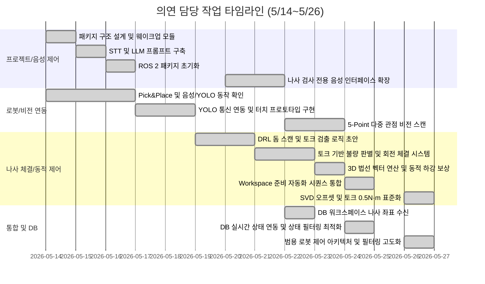

# 📋 의연 담당 작업 타임라인 및 기여 정리

> **기간**: 2026년 5월 14일 ~ 2026년 5월 26일  
> **역할**: 로봇 제어 및 비전/DB 통합(robot_ppv) / LLM 음성 제어(voice_ppv)  
> **주의**: 기존 Pick&Place 레거시(cobot2_ws) 코드를 기반으로 프로젝트 환경을 전면 개편하고, 로봇 모션 설계 및 제어, 센서(토크) 피드백 루프, 음성 인식 및 비전·DB 연동 시스템 구축을 총괄하여 진행함

---

<h2>의연 담당 작업 타임라인 (프로젝트 환경 구축 및 음성 제어)</h2>

<table>
  <thead>
    <tr>
      <th nowrap>작업명</th>
      <th nowrap>날짜</th>
      <th nowrap>담당자</th>
      <th nowrap>파트</th>
      <th nowrap>단계</th>
      <th nowrap>완료 여부</th>
    </tr>
  </thead>
  <tbody>
    <tr><td nowrap>기존 Pick&Place 코드(cobot2_ws) 기반으로 신규 프로젝트 패키지 구조 설계</td><td nowrap>5월 14일</td><td nowrap>조의연</td><td nowrap>프로젝트 환경 구축</td><td nowrap>패키지 설계</td><td nowrap>완료</td></tr>
    <tr><td nowrap>wakeup_word.py 음성 인식 웨이크업 워드 모듈 작성 (OpenWakeWord 기반)</td><td nowrap>5월 14일</td><td nowrap>조의연</td><td nowrap>음성 제어</td><td nowrap>기반 모듈 구현</td><td nowrap>완료</td></tr>
    <tr><td nowrap>STT 모듈(stt.py) 구현: Whisper API 기반 음성→텍스트 변환</td><td nowrap>5월 15일</td><td nowrap>조의연</td><td nowrap>조의연</td><td nowrap>STT 구현</td><td nowrap>완료</td></tr>
    <tr><td nowrap>get_keyword_f.py: LLM(GPT-4o) 프롬프트 기반 음성→과일/목적지 추출 로직 구현</td><td nowrap>5월 15일</td><td nowrap>조의연</td><td nowrap>음성 제어</td><td nowrap>LLM 키워드 추출</td><td nowrap>완료</td></tr>
    <tr><td nowrap>마이크 오디오 설정 및 MicController 파라미터 튜닝 (chunk/rate/device)</td><td nowrap>5월 15일</td><td nowrap>조의연</td><td nowrap>음성 제어</td><td nowrap>하드웨어 세팅</td><td nowrap>완료</td></tr>
    <tr><td nowrap>robot_ppv / voice_ppv ROS 2 패키지 신규 생성 (setup.py, __init__.py)</td><td nowrap>5월 16일</td><td nowrap>조의연</td><td nowrap>프로젝트 환경 구축</td><td nowrap>패키지 초기화</td><td nowrap>완료</td></tr>
    <tr><td nowrap>get_keyword.py (voice_ppv): 나사 검사 전용 음성 명령 인터페이스로 확장 시작</td><td nowrap>5월 20일</td><td nowrap>조의연</td><td nowrap>음성 제어</td><td nowrap>도메인 전환</td><td nowrap>완료</td></tr>
    <tr><td nowrap>LLM 기반 음성 명령 파싱 및 로봇 전달 ('전체 검사해')</td><td nowrap>5월 21일</td><td nowrap>조의연</td><td nowrap>음성/로봇 연동</td><td nowrap>음성 제어</td><td nowrap>완료</td></tr>
    <tr><td nowrap>특정 번호가 부여된 나사 좌표로 이동하는 기능 구현</td><td nowrap>5월 21일</td><td nowrap>조의연</td><td nowrap>음성/로봇 연동</td><td nowrap>모션 제어</td><td nowrap>완료</td></tr>
  </tbody>
</table>

---

<h2>의연 담당 작업 타임라인 (로봇 모션 및 비전 연동)</h2>

<table>
  <thead>
    <tr>
      <th nowrap>작업명</th>
      <th nowrap>날짜</th>
      <th nowrap>담당자</th>
      <th nowrap>파트</th>
      <th nowrap>단계</th>
      <th nowrap>완료 여부</th>
    </tr>
  </thead>
  <tbody>
    <tr><td nowrap>기존 robot_control_before.py 음성 → YOLO → Pick&Place 파이프라인 동작 확인</td><td nowrap>5월 14일</td><td nowrap>조의연</td><td nowrap>로봇/음성 연동</td><td nowrap>동작 테스트</td><td nowrap>완료</td></tr>
    <tr><td nowrap>robot_control_before.py를 robot_ppv 패키지로 이관 및 패키지 경로 수정</td><td nowrap>5월 16일</td><td nowrap>조의연</td><td nowrap>로봇 제어</td><td nowrap>코드 마이그레이션</td><td nowrap>완료</td></tr>
    <tr><td nowrap>voice_ppv에 get_keyword.py 서비스 노드 통합 및 음성→YOLO 연동 테스트</td><td nowrap>5월 16일</td><td nowrap>조의연</td><td nowrap>음성/비전 연동</td><td nowrap>연동 테스트</td><td nowrap>완료</td></tr>
    <tr><td nowrap>robot_control_pose.py: 음성 목적지(pose1/2/3) 기반 Drop 위치 분기 로직 구현</td><td nowrap>5월 17일</td><td nowrap>조의연</td><td nowrap>로봇 제어</td><td nowrap>음성 목적지 분기</td><td nowrap>완료</td></tr>
    <tr><td nowrap>Docker 컨테이너에 YOLO 노드 분리 배치 및 Host PC와의 ROS 2 통신 연동 성공</td><td nowrap>5월 17일</td><td nowrap>조의연</td><td nowrap>인프라/비전 연동</td><td nowrap>Docker 연동</td><td nowrap>완료</td></tr>
    <tr><td nowrap>서비스 Request 스레드 간섭 버그 해결 (멤버변수→로컬변수 독립 Request 생성)</td><td nowrap>5월 17일</td><td nowrap>조의연</td><td nowrap>로봇 제어</td><td nowrap>디버깅</td><td nowrap>완료</td></tr>
    <tr><td nowrap>robot_control_test.py: YOLO 좌표 기반 나사 터치 테스트(touch_target) 프로토타입</td><td nowrap>5월 18일</td><td nowrap>조의연</td><td nowrap>로봇 제어</td><td nowrap>터치 테스트</td><td nowrap>완료</td></tr>
    <tr><td nowrap>카메라→로봇 베이스 좌표 변환(transform_to_base) Hand-Eye 캘리브레이션 연동</td><td nowrap>5월 18일</td><td nowrap>조의연</td><td nowrap>로봇/비전 연동</td><td nowrap>좌표 변환</td><td nowrap>완료</td></tr>
    <tr><td nowrap>YOLO 비전 획득 좌표 리스트 인덱싱 및 선택적 이동 분기 로직</td><td nowrap>5월 21일</td><td nowrap>조의연</td><td nowrap>로봇 제어</td><td nowrap>좌표 체계화</td><td nowrap>완료</td></tr>
    <tr><td nowrap>5-Point 다중 관점 비전 스캔 자동화 모션 및 좌표 동기화</td><td nowrap>5월 22일</td><td nowrap>조의연</td><td nowrap>로봇/비전 연동</td><td nowrap>스캔 시스템</td><td nowrap>완료</td></tr>
    <tr><td nowrap>워크스페이스 탐색 모션 중 자율 비전 검사 서비스(Trigger) 완벽 연동</td><td nowrap>5월 23일</td><td nowrap>조의연</td><td nowrap>로봇/비전 연동</td><td nowrap>검사 루틴 통합</td><td nowrap>완료</td></tr>
  </tbody>
</table>

---

<h2>의연 담당 작업 타임라인 (나사 체결 검사 시스템 및 동적 제어)</h2>

<table>
  <thead>
    <tr>
      <th nowrap>작업명</th>
      <th nowrap>날짜</th>
      <th nowrap>담당자</th>
      <th nowrap>파트</th>
      <th nowrap>단계</th>
      <th nowrap>완료 여부</th>
    </tr>
  </thead>
  <tbody>
    <tr><td nowrap>robot_spin.py: DRL 기반 돔 스캔 궤적(Dome Scan) 경로 생성 및 순응제어 적용</td><td nowrap>5월 19일</td><td nowrap>조의연</td><td nowrap>로봇 제어</td><td nowrap>스캔 모션 설계</td><td nowrap>완료</td></tr>
    <tr><td nowrap>법선벡터 블렌딩(75% 하방 + 25% 표면법선) 기반 스캔 자세 연산 알고리즘 구현</td><td nowrap>5월 19일</td><td nowrap>조의연</td><td nowrap>로봇 제어</td><td nowrap>자세 연산</td><td nowrap>완료</td></tr>
    <tr><td nowrap>robot_control_main.py: 음성 명령 → YOLO → Pick&Place 통합 메인 노드 정리</td><td nowrap>5월 19일</td><td nowrap>조의연</td><td nowrap>로봇/음성 연동</td><td nowrap>메인 노드 통합</td><td nowrap>완료</td></tr>
    <tr><td nowrap>robot_control_test2.py 등 파이프라인 디버깅 및 좌표 체계화</td><td nowrap>5월 19일</td><td nowrap>조의연</td><td nowrap>로봇 제어</td><td nowrap>디버깅</td><td nowrap>완료</td></tr>
    <tr><td nowrap>robot_driver_check.py: 나사 위치 이동 후 토크 검출 초기 프로토타입 작성</td><td nowrap>5월 20일</td><td nowrap>조의연</td><td nowrap>로봇 제어</td><td nowrap>검사 로직 초안</td><td nowrap>완료</td></tr>
    <tr><td nowrap>robot_driver_check_test.py: 토크 모니터링 검사 로직 반복 테스트 및 개선</td><td nowrap>5월 20일</td><td nowrap>조의연</td><td nowrap>로봇 제어</td><td nowrap>검사 로직 테스트</td><td nowrap>완료</td></tr>
    <tr><td nowrap>토크값 기반 불량 판별 기준 확립 (기준 이상=정상 조건 반전)</td><td nowrap>5월 21일</td><td nowrap>조의연</td><td nowrap>로봇 제어</td><td nowrap>검사 로직</td><td nowrap>완료</td></tr>
    <tr><td nowrap>외부 토크 센서(J6) 실시간 피드백 루프 구현 (`get_external_torque`)</td><td nowrap>5월 22일</td><td nowrap>조의연</td><td nowrap>로봇 제어</td><td nowrap>동적 토크 제어</td><td nowrap>완료</td></tr>
    <tr><td nowrap>단순 터치 방식에서 그리퍼 회전 체결(Grip & Tighten) 시스템으로 전면 개편</td><td nowrap>5월 22일</td><td nowrap>조의연</td><td nowrap>로봇 제어</td><td nowrap>체결 아키텍처</td><td nowrap>완료</td></tr>
    <tr><td nowrap>목표 토크 도달 시 즉각 회전 정지 및 순응 제어(Compliance Control) 적용</td><td nowrap>5월 22일</td><td nowrap>조의연</td><td nowrap>로봇 제어</td><td nowrap>안전 모션</td><td nowrap>완료</td></tr>
    <tr><td nowrap>비전 검출 오차 오프셋 보정 및 실패 시 다시 시도하는 Re-gripping 복구 로직</td><td nowrap>5월 22일</td><td nowrap>조의연</td><td nowrap>로봇 제어</td><td nowrap>예외 처리</td><td nowrap>완료</td></tr>
    <tr><td nowrap>체결 시 그리퍼 미끄러짐 방지를 위한 '동적 Z축 하강 보상' 알고리즘 고안</td><td nowrap>5월 23일</td><td nowrap>조의연</td><td nowrap>로봇 제어</td><td nowrap>체결 신뢰성 강화</td><td nowrap>완료</td></tr>
    <tr><td nowrap>3차원 좌표 기반 워크스페이스 평면 법선 벡터(Normal Vector) 연산</td><td nowrap>5월 23일</td><td nowrap>조의연</td><td nowrap>로봇 제어</td><td nowrap>수학적 3D 연산</td><td nowrap>완료</td></tr>
    <tr><td nowrap>법선 벡터 연산에 따른 워크스페이스별 동적 3D 자세 제어(Approach Angle) 적용</td><td nowrap>5월 23일</td><td nowrap>조의연</td><td nowrap>로봇 제어</td><td nowrap>동적 자세 제어</td><td nowrap>완료</td></tr>
    <tr><td nowrap>로봇 및 환경 초기화를 위한 'Workspace 준비' 자동화 시퀀스 통합</td><td nowrap>5월 24일</td><td nowrap>조의연</td><td nowrap>로봇 제어</td><td nowrap>시작 준비</td><td nowrap>완료</td></tr>
    <tr><td nowrap>SVD(특이값 분해) 연산 기반의 동적 축(Axis-based) 3D 좌표 오프셋 도입</td><td nowrap>5월 26일</td><td nowrap>조의연</td><td nowrap>로봇 제어</td><td nowrap>범용 좌표 연산</td><td nowrap>완료</td></tr>
    <tr><td nowrap>자세/중력 변화에 따른 실세계 토크 센서 영점(Baseline) 노이즈 확인 및 대응</td><td nowrap>5월 26일</td><td nowrap>조의연</td><td nowrap>로봇 제어</td><td nowrap>디버깅 및 보정</td><td nowrap>완료</td></tr>
    <tr><td nowrap>중력 편차를 극복하는 체결 판별 최소 토크 절댓값(0.5 N·m) 표준화 정립</td><td nowrap>5월 26일</td><td nowrap>조의연</td><td nowrap>로봇 제어</td><td nowrap>센서 데이터 정규화</td><td nowrap>완료</td></tr>
  </tbody>
</table>

---

<h2>의연 담당 작업 타임라인 (시스템 통합 및 DB 연동)</h2>

<table>
  <thead>
    <tr>
      <th nowrap>작업명</th>
      <th nowrap>날짜</th>
      <th nowrap>담당자</th>
      <th nowrap>파트</th>
      <th nowrap>단계</th>
      <th nowrap>완료 여부</th>
    </tr>
  </thead>
  <tbody>
    <tr><td nowrap>Firebase DB 내 워크스페이스 나사 3D 좌표 유닛 변환 연동</td><td nowrap>5월 22일</td><td nowrap>조의연</td><td nowrap>로봇/DB 연동</td><td nowrap>데이터 수신</td><td nowrap>완료</td></tr>
    <tr><td nowrap>realtime_3d_mapper_multi 노드 연동 (실시간 입체 환경 매핑 파이프라인 통합)</td><td nowrap>5월 24일</td><td nowrap>조의연</td><td nowrap>시스템 통합</td><td nowrap>3D 연동</td><td nowrap>완료</td></tr>
    <tr><td nowrap>DB 라이브 스캔 좌표 파이프라인(`live_scan/workstations`) 마이그레이션 적용</td><td nowrap>5월 24일</td><td nowrap>조의연</td><td nowrap>로봇/DB 연동</td><td nowrap>파이프라인 재설계</td><td nowrap>완료</td></tr>
    <tr><td nowrap>결함(`defective`) 나사 선별 필터링을 통한 지능적 모션 분기 최적화</td><td nowrap>5월 24일</td><td nowrap>조의연</td><td nowrap>시스템 통합</td><td nowrap>상태 기반 작업</td><td nowrap>완료</td></tr>
    <tr><td nowrap>체결 성공 시 DB 상태값을 `normal`로 변경하는 실시간 양방향 통신망 구축</td><td nowrap>5월 24일</td><td nowrap>조의연</td><td nowrap>로봇/DB 연동</td><td nowrap>피드백 루프</td><td nowrap>완료</td></tr>
    <tr><td nowrap>하드코딩을 탈피한 Workspace-agnostic 범용 로봇 제어 아키텍처 달성</td><td nowrap>5월 26일</td><td nowrap>조의연</td><td nowrap>시스템 통합</td><td nowrap>시스템 고도화</td><td nowrap>완료</td></tr>
    <tr><td nowrap>defective / defect 상태에 대한 엄격한 타겟 필터링 파이프라인 고도화</td><td nowrap>5월 26일</td><td nowrap>조의연</td><td nowrap>시스템 통합</td><td nowrap>로직 최적화</td><td nowrap>완료</td></tr>
  </tbody>
</table>

---

## 📊 타임라인

---

## 🔑 핵심 전환점

| # | 전환점 | 관련 내용 | 날짜 |
|---|--------|----------|------|
| 1 | ROS 2 패키지 개편 | 기존 Pick&Place 코드를 모듈화하여 `robot_ppv`, `voice_ppv` 패키지로 분리 | 5월 14일 |
| 2 | LLM 기반 음성 제어 도입 | GPT-4o를 연동해 '전체 검사해' 등 의도 기반 파싱 및 명령 전달 처리 | 5월 15~21일 |
| 3 | Hand-Eye 좌표계 캘리브레이션 연동 | 카메라 2D 좌표를 로봇 3D 베이스 좌표로 변환 성공 | 5월 18일 |
| 4 | 체결 시스템 개편 | 단순 터치 방식에서 토크 기반의 실제 회전 체결(Grip & Tighten) 시스템으로 고도화 | 5월 22일 |
| 5 | 평면 법선 벡터 기반 동적 제어 | 3차원 좌표 기반 워크스페이스 법선 벡터를 연산해 Approach Angle 적용 | 5월 23일 |
| 6 | 양방향 실시간 DB 연동망 구축 | Firebase 내 체결 성공 시 상태값(normal) 갱신, 결함(defective) 나사 필터링 | 5월 24일 |
| 7 | 동적 축(Axis-based) 3D 오프셋 도입 | SVD 연산을 도입해 워크스페이스 방향에 구애받지 않는 좌표 오프셋 보정 아키텍처 완성 | 5월 26일 |
| 8 | 체결 판별 최소 토크 절댓값 표준화 | 중력 편차 극복을 위해 0.5 N·m 절댓값 기반으로 토크 모니터링 기준 정규화 | 5월 26일 |

---

## 🧩 담당 역할 요약

조의연은 협동2 프로젝트에서 '로봇 제어 및 비전/DB 통합(robot_ppv)' 파트와 'LLM 음성 제어(voice_ppv)' 파트를 전담하여, Doosan M0609 로봇을 활용한 나사 체결 자동화 시스템의 전체 모션 제어 및 외부 연동 아키텍처를 설계하고 구현하였다.

14~16일에는 기존 Pick&Place 레거시 코드(cobot2_ws)를 분석하여 robot_ppv / voice_ppv라는 신규 ROS 2 패키지 구조를 설계·생성하고, OpenWakeWord 기반 웨이크업 워드 모듈, Whisper API 기반 STT 모듈, 그리고 GPT-4o LLM을 활용한 음성 키워드 추출 파이프라인을 구축하였다.

17~18일에는 음성 인식으로 받은 목적지(pose1/2/3)에 따라 로봇이 물체를 놓을 위치를 동적으로 분기하는 robot_control_pose.py를 구현하고, YOLO 좌표를 Hand-Eye 캘리브레이션을 통해 로봇 베이스 좌표로 변환하여 나사 정중앙을 정확히 터치(touch_target)하는 프로토타입을 완성했다.

19~20일에는 DRL 기반 돔형 스캔 궤적(robot_spin.py)을 수학적으로 설계하고, 토크 모니터링을 통한 나사 불량 검사 로직의 초기 프로토타입(robot_driver_check 시리즈)을 반복 작성하며 체결 검사 시스템의 기초를 다졌다.

21일 이후에는 그리퍼 직접 파지 체결, 동적 Z축 보상, SVD 좌표 변환, Firebase 양방향 통신 등 핵심 알고리즘과 시스템 통합을 주도하였다.

---

## ✅ 최종 정리

조의연의 주요 기여는 로봇 제어에서 시작해 비전, 음성 인식, 외부 DB에 이르는 광범위한 모듈들을 안정적이고 유기적으로 통합하는 아키텍처 구축에 있다.

특히, LLM을 접목해 단순한 음성 명령을 넘어 맥락이 반영된 로봇 작업을 수행하도록 구성하였으며, 하드코딩된 로봇 궤적 대신 3D 법선 벡터와 SVD 기반 좌표 오프셋을 사용해 워크스페이스 위치·각도가 변해도 유연하게 대응할 수 있는 **Workspace-agnostic**한 범용 체결 로직을 완성했다.

또한 실시간 토크 피드백과 동적 Z축 하강 보상 등 미세 제어 기술을 통해 나사 체결의 안정성과 정확도를 획기적으로 향상시켰으며, 체결 성공 여부를 DB와 실시간 통신하며 기록하는 완전 자동화 인프라를 달성했다. 자세한 디버깅 이력과 프로젝트 회고는 [DEBUGGING.md](DEBUGGING.md) 파일에서 확인할 수 있다.
